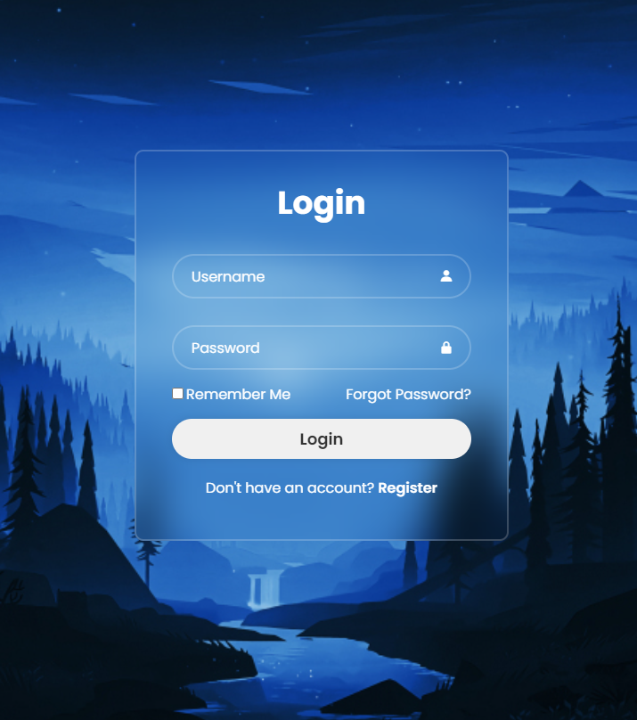

---

# Página de Login

Este projeto é uma página de login simples, criada utilizando HTML e CSS. O objetivo principal deste projeto é fornecer um layout de formulário de login básico, que pode ser utilizado como base em outros projetos web.

## Funcionalidades

- **Formulário de Login**: O formulário permite que o usuário insira um nome de usuário e uma senha.
- **Ícones**: Utiliza ícones para representar o nome de usuário e a senha, proporcionando uma interface visualmente agradável.
- **Links de Ação**: Inclui opções para "Lembrar de mim", "Esqueci minha senha" e "Registrar-se".
- **Design Responsivo**: O design é responsivo, ajustando-se a diferentes tamanhos de tela.

## Tecnologias Utilizadas

- **HTML5**: Estruturação semântica do conteúdo.
- **CSS3**: Estilização e layout da página.
- **Boxicons**: Ícones utilizados nos campos de entrada.

## Estrutura do Projeto

O projeto é composto por dois arquivos principais:

- **index.html**: Contém a estrutura HTML da página.
- **style.css**: Contém o código CSS responsável pela estilização.

### Arquivo `index.html`

- Define a estrutura básica da página de login.
- Contém o formulário de login com campos para "Username" e "Password".
- Inclui links para as bibliotecas de fontes e ícones utilizadas.

### Arquivo `style.css`

- Estiliza o layout da página, incluindo o posicionamento dos ícones e a responsividade.
- Utiliza Flexbox para organizar os elementos dentro do contêiner principal.

## Demonstração

## Licença

Este projeto é de código aberto e está disponível sob a licença [MIT](LICENSE).

---